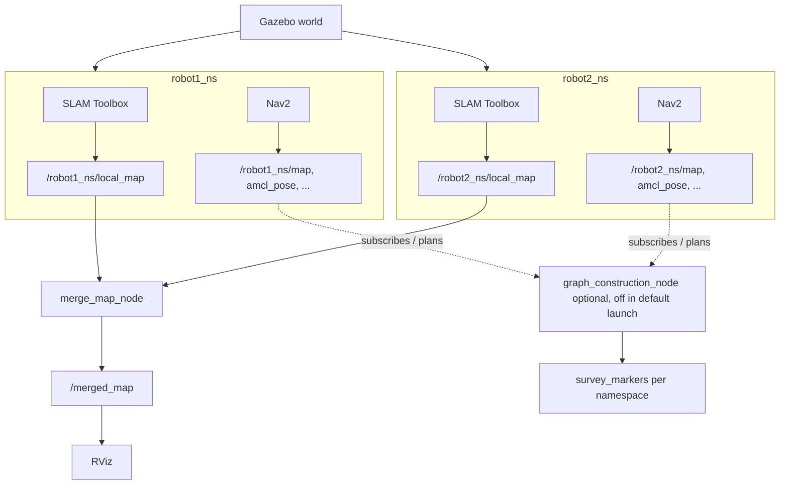

# ROS 2 Multi-Agent Disaster Response Platform

**Main entrypoint (after build):** `ros2 launch multi_robot_mission_stack fully_integrated_swarm.launch.py`
Set `export TURTLEBOT3_MODEL=waffle` first.

ROS 2 **Humble** simulation stack: **two** TurtleBot3-class robots in Gazebo (default world: **`turtlebot3_house`** from `turtlebot3_gazebo`, matching upstream Nav2 sim bringup), each with **SLAM Toolbox** and **Navigation2**, plus a **central** `merge_map_node` that fuses per-robot SLAM maps into `/merged_map` for shared situational awareness in RViz. An optional custom world file lives at `worlds/disaster_world.world` if you wire it into your launch.

Demo: [YouTube](https://www.youtube.com/watch?v=nfTs7sWDnww)

## System Overview
Two robots run as `robot1_ns` and `robot2_ns`: each namespace owns its own SLAM + Nav2 (decentralized autonomy on a shared world).
`merge_map_node` listens for each robot’s `local_map` topic and publishes `/merged_map` (centralized map fusion for visualization/analysis).
“Human-driven navigation strategies” here means **map-derived landmark-style reasoning**: candidate goals from free space, validated with Nav2 path planning rather than blind motion.
Together: per-robot stacks + one shared merged map view—typical of real multi-robot field systems.

## Architecture (quick diagram)



Per robot, SLAM and Nav2 run in parallel inside the namespace. `merge_map_node` is a **single global node** that subscribes to each robot’s `local_map`, fuses them, and feeds `/merged_map` into RViz. `graph_construction_node` is included in the repo for strategy/path experiments (markers on `/<robot_namespace>/survey_markers`); the **default** `fully_integrated_swarm` launch does **not** start it—uncomment it in the launch file or run it manually if you want those topics live.

## Key Features
- Multi-robot Gazebo simulation with isolated namespaces (`robot1_ns`, `robot2_ns`).
- Per-robot SLAM Toolbox + Nav2 bringup.
- `merge_map_node`: fuses local maps → `/merged_map` (enabled in `fully_integrated_swarm.launch.py`).
- `graph_construction_node`: Nav2 `ComputePathToPose` + `survey_markers` visualization (**optional**; not part of the default integrated launch).

## Requirements
- Ubuntu 22.04 + ROS 2 Humble (or Humble on WSL2 with Gazebo working)
- Gazebo + ROS integration, TurtleBot3 sim packages, Nav2 bringup, SLAM Toolbox (apt)

> Simulation-focused: install `nav2_bringup`, `slam_toolbox`, `turtlebot3_gazebo`, etc. from apt.

## How to run in 2 minutes
Assuming the workspace is already built (see Quickstart below):

```bash
source /opt/ros/humble/setup.bash
cd ~/ros2_ws && source install/setup.bash
export TURTLEBOT3_MODEL=waffle
ros2 launch multi_robot_mission_stack fully_integrated_swarm.launch.py
```

**What you should see:** Gazebo with **two** robots; RViz windows including the map-merge view; topic **`/merged_map`** updating from `merge_map_node`. Per-robot Nav2 + SLAM traffic under `/robot1_ns/...` and `/robot2_ns/...`.

## Quickstart (first-time build)

### 1) Install ROS 2 and dependencies (apt)
```bash
sudo apt update
sudo apt install ros-humble-desktop \
  ros-humble-nav2-bringup \
  ros-humble-slam-toolbox \
  ros-humble-gazebo-* \
  ros-humble-turtlebot3* \
  ros-humble-rviz2
```

### 2) Build with colcon
```bash
mkdir -p ~/ros2_ws/src && cd ~/ros2_ws/src
git clone https://github.com/AmirMohaddesi/Human-driven-navigation-strategies-in-a-ROS2-environment.git
cd ~/ros2_ws
colcon build --symlink-install
source install/setup.bash
```

### 3) Run
```bash
export TURTLEBOT3_MODEL=waffle
ros2 launch multi_robot_mission_stack fully_integrated_swarm.launch.py
```

## Optional: `graph_construction_node`
Not started by `fully_integrated_swarm` by default. To try it for one robot after the stack is up:

```bash
ros2 run multi_robot_mission_stack graph_construction_node --ros-args -p robot_namespace:=robot1_ns
```

Publishes markers on `/<robot_namespace>/survey_markers` when the planner and topics are available.

## Optional: YOLO vision node
`yolo_detection_node` is **optional**; YOLOv3 **weights/config are not** in the repo. Provide paths:

```bash
ros2 run multi_robot_mission_stack yolo_detection_node \
  --ros-args \
  -p weights_path:=/path/to/yolov3.weights \
  -p cfg_path:=/path/to/yolov3.cfg \
  -p display:=false
```

## What makes this interesting
- Clear **decentralized / centralized** split: each robot runs SLAM+Nav2; one `merge_map_node` builds a shared `/merged_map`.
- Strategy-style behavior without hand-wavy ML: **free-space sampling + Nav2 feasibility checks** (human-inspired waypoint thinking).
- Credible robotics narrative for interviews: namespaces, TF, costmaps, SLAM outputs, and a real merge consumer in RViz.

## Limitations (honest)
- **Simulation-first**; tuned for Gazebo + this package’s launch wiring (default **TurtleBot3 house** world, not `disaster_world.world`, unless you change the launch).
- **`/merged_map` is not** the default Nav2 global map input; per-robot Nav2 still uses the map YAML from bringup—merge is mainly for shared awareness / analysis in RViz.
- **YOLO** is optional and needs external weights/cfg.
- **`graph_construction_node`** is off in the default integrated launch; enable explicitly if you want `survey_markers`.

## Documentation
- `docs/index.md` · `docs/installation.md` · `docs/architecture.md` · `docs/launch_files.md`

## License
Apache License 2.0. See `LICENSE`.
